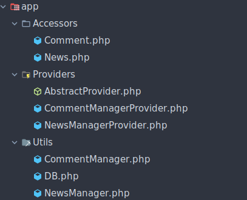
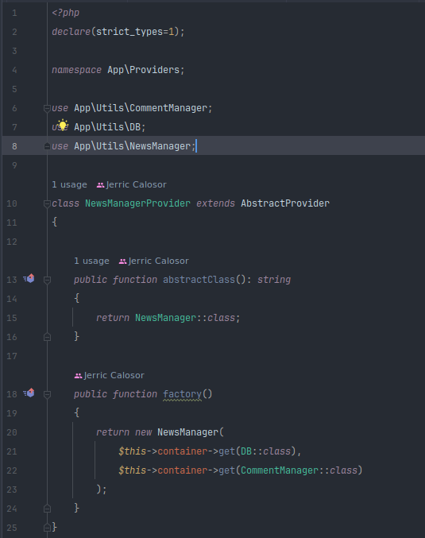
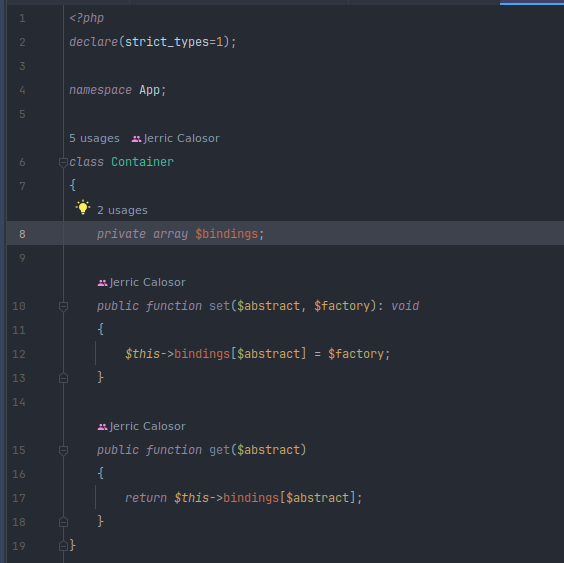
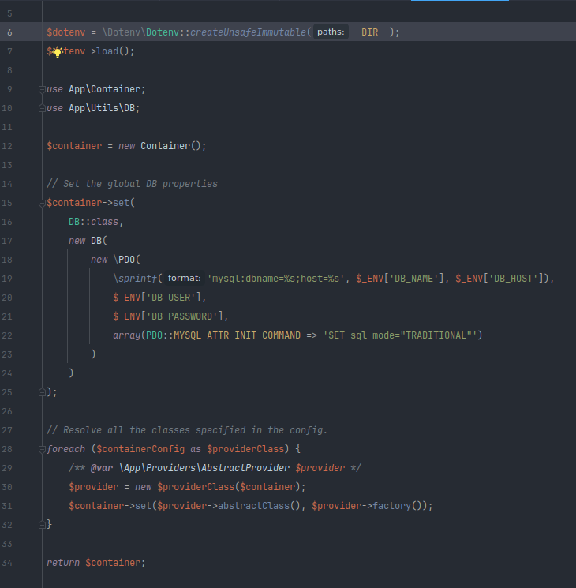
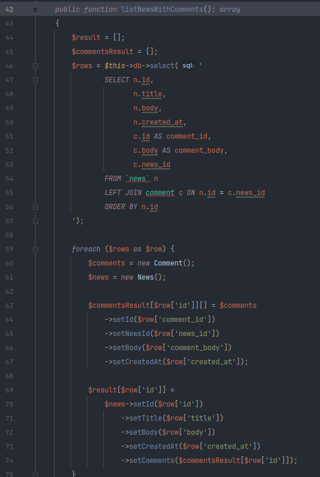
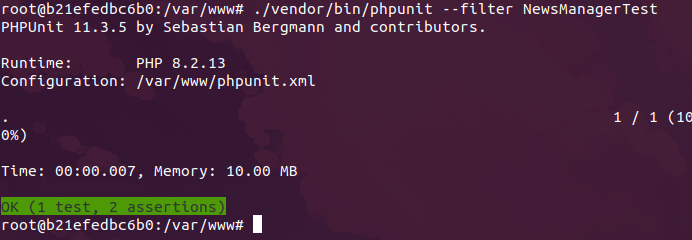
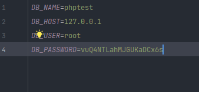

# Pre-requisite

* Docker version 27.^
* Docker Compose version 1.26.^

*** This can still be run without docker, but you will need to have PHP 8.2 installed and composer

# Installation
These installation steps assumes that docker is already installed.

1. `cd /path/to/code` 
2. `cd docker`
3. `docker network create nginx-proxy`
4. `docker-compose build`
5. `docker-compose up -d`
6. `docker exec -ti docker_api_1 bash` 
7. `composer install`
8. `cp env.example .env`

# Testing
1. Access the app's container `docker exec -ti docker_api_1 bash`
2. run `php index.php` ( this still outputs the same output as before )
3. run the sample unit test `./vendor/bin/phpunit --filter NewsManagerTest`

# Changes
The following changes are the result of an effort to satisfy the requirements which are:
1. Easier to work with
2. More maintainable
I've implemented specific application structure following Laravel's design, since I do believe that it increases the ease of managing classes and implementations,
Also added dependency injection (DI) to increase the testability of the implementations.

## Changelog:
1. Containerization, using docker, making the app more portable, therefore can be setup to a multitude of environments ( Mac, Linux as tested )
2. Added composer autoloader to easily manage autoloading of classes, this enabled the app to implement PSR-12 namespace & import class statements
3. Implementing application structure that imposes categorization of code by functionality:
   
   * Accessor - for the setter and getter class
   * Providers - "provides" the resolved instance of classes needed to be registered in the container
   * Utils - Common `service` class
4. Created a IoC manager logic that enables reusable "resolved" classes to be used across the application:
    
    
5. Created a bootstrapper logic that will knit these resolved classes together to be available at run time.
    
5. Refactored `App\Utils\NewsManager` class and implemented a new method `listNewsWithComments` that minimizes the database call to only 1 for getting the list of news along with it's respective comments

6. Written a sample unit test

7. Added .env for environment variable control, the database credentials are stored here.
